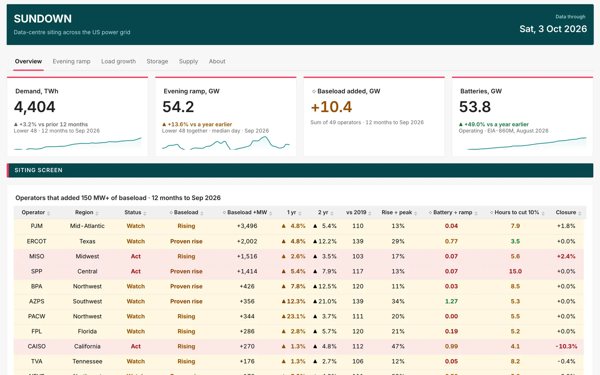

# Chartwright

[](https://pypi.org/project/chartwright/) [](https://pypi.org/project/chartwright/) [](https://github.com/debabsah/chartwright/actions/workflows/ci.yml) [](docs/VERIFICATION.md) [](LICENSE)

Chartwright is a command-line tool that manages Apache Superset dashboards as code: one JSON spec file per dashboard, covering its charts and how each is drawn, its filters, layout, text, colours and styling, and naming the datasets it reads. Chartwright creates or updates the dashboard on your Superset instances from the spec, reports where the live dashboard differs from it, and can generate a spec from a dashboard that already exists. Specs can be written by hand or by an AI agent, and both go through identical validation before anything changes in Superset.



*Sundown, a six-tab dashboard built using Chartwright.*

| You can | Instead of (Superset up to 6.1.0, [cited to source](docs/CONTRACTS.md)) | How it works |
|---|---|---|
| ● [Move dashboards between dev, staging, prod or another instance, including ones built in the UI](docs/MOVE-BETWEEN-INSTANCES.md) | Re-importing dashboard exports in the UI, which update the dashboard but not the charts already in it ([#34879](https://github.com/apache/superset/issues/34879), fixed after 6.1.0, not yet released) | [MOVE-BETWEEN-INSTANCES.md](docs/MOVE-BETWEEN-INSTANCES.md) |
| ● [Clone any dashboard onto another dataset, team or tenant](docs/CLONE-A-DASHBOARD.md) | Editing exported files, or copying the dashboard and re-pointing each chart at the new dataset by hand ([Stack Overflow](https://stackoverflow.com/q/69179618), [#20090](https://github.com/apache/superset/issues/20090)) | [CLONE-A-DASHBOARD.md](docs/CLONE-A-DASHBOARD.md) |
| ● [Describe a dashboard, or a change to one chart, to an AI agent and have it built, checked and updated in place, without learning Superset's editor](docs/AI-AGENTS.md) | Learning the chart editor, where tasks can take "hours of searching" ([Hacker News](https://news.ycombinator.com/item?id=39512272)), or Superset's MCP tools, which create a new dashboard on every build and can only add charts to an existing one ([#39864](https://github.com/apache/superset/discussions/39864)) | [AI-AGENTS.md](docs/AI-AGENTS.md) |
| ● [Lay out rows, columns and tabs by drawing them as text, and keep heights you adjust in Superset](docs/LAYOUT-GUIDE.md) | Nesting columns inside rows in the editor to place a tall chart beside two stacked ones ([2019](https://stackoverflow.com/q/55665527), [2026](https://stackoverflow.com/q/79905463)) | [LAYOUT-GUIDE.md](docs/LAYOUT-GUIDE.md) |
| ● [Review dashboard changes as a readable diff in a pull request, and check them in CI before they go live](docs/DEPLOY-FROM-GIT.md) | Exports full of instance-specific ids, which don't diff or merge cleanly in git ([#30190](https://github.com/apache/superset/discussions/30190)), and no settled way to deploy dashboards through CI/CD ([Stack Overflow](https://stackoverflow.com/q/79809865), unanswered) | [DEPLOY-FROM-GIT.md](docs/DEPLOY-FROM-GIT.md) |
| ● [Roll back any change, chart settings included, from a backup saved automatically before every apply](docs/HISTORY-AND-ROLLBACK.md) | Remembering to export before each change, then re-importing, which restores the dashboard but not its charts' settings ([#34879](https://github.com/apache/superset/issues/34879), fixed after 6.1.0, not yet released); re-importing deleted assets can also fail ([#44309](https://github.com/apache/superset/issues/44309)) | [HISTORY-AND-ROLLBACK.md](docs/HISTORY-AND-ROLLBACK.md) |
| ● [Rebuild your dashboards on a new Superset version from the same specs](docs/SUPERSET-VERSIONS.md) | Checking and repairing charts by hand when an upgrade leaves them blank in the editor ([#32725](https://github.com/apache/superset/discussions/32725)) | [SUPERSET-VERSIONS.md](docs/SUPERSET-VERSIONS.md) |
| ● [Create dashboards from code without reverse-engineering Superset's JSON](docs/DASHBOARDS-FROM-CODE.md) | Working out the undocumented layout JSON, `position_json` ([#32970](https://github.com/apache/superset/discussions/32970)) | [DASHBOARDS-FROM-CODE.md](docs/DASHBOARDS-FROM-CODE.md) |

## Install

```bash
pip install chartwright            # Python 3.11 or newer
pip install "chartwright[mcp]"     # adds the MCP server for AI clients, chartwright-mcp
pip install "chartwright[visual]"  # for chartwright save-queries (CSV reports on built charts);
                                   # then run: playwright install chromium
```

## Try it on your Superset

A dev or test instance is ideal. Add a profile to `~/.config/chartwright/profiles.toml`; it names the instance and where the password comes from, never the password itself:

```toml
[dev]
base_url = "https://superset-dev.example.com"
username = "chartwright"
password_env = "SUPERSET_DEV_PASSWORD"
```

Export the password variable, change the example below to name one of your Superset datasets (its database connection and table) and its columns, and build it:

```bash
chartwright validate orders.json                # offline: the fields and the layout
chartwright apply orders.json --profile dev     # checks every reference, builds, then confirms each chart landed and runs its query
```

```json
{
  "spec_version": "1",
  "dashboard": {"title": "Orders", "slug": "orders"},
  "charts": [
    {"name": "Revenue by Month", "type": "timeseries_line", "metrics": ["SUM(amount) AS Revenue"],
     "groupby": "region", "time_column": "ordered_at", "time_grain": "P1M",
     "dataset": {"database": "warehouse", "table": "orders"}},
    {"name": "Revenue", "type": "big_number_total", "metric": "SUM(amount)", "number_format": "$,.0f",
     "dataset": {"database": "warehouse", "table": "orders"}},
    {"name": "Orders", "type": "big_number_total", "metric": "COUNT(*)", "number_format": ",.0f",
     "dataset": {"database": "warehouse", "table": "orders"}}
  ],
  "filters": [{"type": "time_range", "name": "Order date", "default": "No filter"}],
  "layout": {"line": 4, "sketch": ["MMMMMMMM RRRR",
                                   "MMMMMMMM OOOO"],
             "legend": {"M": "Revenue by Month", "R": "Revenue", "O": "Orders"}}
}
```

The `sketch` draws the layout: a run of the same letter is one chart, and its length sets the chart's width, so Revenue by Month fills two-thirds of the row with Revenue and Orders stacked beside it.

## Requirements and limits

- **Sign-in:** a Superset user with database or LDAP login, or Preset API tokens; Chartwright doesn't sign in through SSO or OAuth. On an instance that uses SSO, ask your admin for an account that has a Superset password. All testing uses the Admin role.
- **Datasets:** datasets and database connections stay in Superset; create them on each instance first. A spec names each dataset by its database connection and table, so where connection names differ between instances, keep one copy of the spec per instance.
- **Ownership:** Chartwright changes only dashboards it built or that you adopted, so give each team its own slug prefix. To manage a UI-made dashboard where it is, run `chartwright adopt`; it names every setting the first apply will reset, before you apply.
- **Edits:** each `apply` writes the spec over the dashboard and undoes edits made in the UI, and takes a chart added there off the dashboard (the chart itself stays in Superset's Charts list); make lasting changes, and add new charts, in the spec. To keep chart heights you set by dragging in Superset, run `chartwright absorb` first; it copies them into the spec.
- **Status:** version 0.6.0, beta. CI builds on real Superset 4.1.4, 5.0.0 and 6.1.0 on every pull request ([how it's tested](docs/VERIFICATION.md)).

Every limit, with what to do instead: [Limits](docs/LIMITS.md).

Every capability and command: [FEATURES.md](docs/FEATURES.md) · How it's tested: [VERIFICATION.md](docs/VERIFICATION.md) · Superset's behaviour, cited to source: [CONTRACTS.md](docs/CONTRACTS.md) · Compared with preset-cli, sup and Terraform: [COMPARISON.md](docs/COMPARISON.md) · Design rules: [DESIGN-BRAIN.md](docs/DESIGN-BRAIN.md)

[Changelog](CHANGELOG.md) · [Stability](docs/STABILITY.md) · [Contributing](CONTRIBUTING.md) · Apache-2.0 ([LICENSE](LICENSE), [NOTICE](NOTICE))

---

Apache Superset and Superset are trademarks of the Apache Software Foundation. No endorsement by the ASF is implied.
