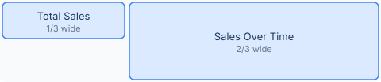
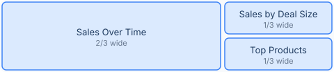
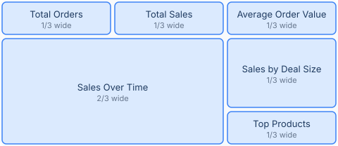

# Layout Sketches

Draw a dashboard's layout as text, right in the spec: each letter is a chart,
and the drawing's proportions become the dashboard's proportions. Every
example on this page compiles as shown.

A sketch is three fields, in the spec's `layout` or inside any tab:

```json
"layout": {
  "sketch": ["KKKK LLLLLLLL"],
  "legend": {"K": "Total Sales", "L": "Sales Over Time"}
}
```

- `sketch`: one string per drawn line. Spaces are cosmetic; use them to keep
  the drawing readable.
- `legend`: maps each symbol to a chart's name from the spec.
- `line` (optional, default 2): the height each drawn line adds. One drawn
  line is about 80 pixels of chart; raise or lower `line` to change that.

## Charts side by side

```text
KKKK LLLLLLLL
```


Letters share the row in proportion to how many you draw: `K` takes a third
of the page, `L` takes two thirds. To widen a chart, give it more letters.
Widths land on Superset's 12-column grid.

## Changing the ratio

The same two charts, redrawn with different letter counts:

```text
KKKKKK LLLLLL
```


```text
KKK LLLLLLLLL
```


A chart's share of the row is its share of the letters: six beside six is an
even split, three beside nine is a quarter beside three quarters. Resize a
chart by taking letters from its neighbor.

## Taller charts

```text
KKKK LLLLLLLL
.... LLLLLLLL
```



Repeat a line to make its charts taller: `L` spans two lines, so it is twice
as tall as `K`. The dots mark the space below `K` as deliberately empty.

## Charts stacked beside a tall one

```text
TTTTTTTT SSSS
TTTTTTTT PPPP
```



Stack different symbols in the same slot and they become a column: `S` sits
above `P`, both beside the tall `T`.

## Empty space

```text
AAAA BBBB ....
```


Dots leave cells empty. Superset packs charts to the left and top, so empty
space goes at the right edge of a row or the bottom of a stack; a dot
anywhere else stops the compile with a message naming the exact cell.

## A complete dashboard

```text
KKKK MMMM NNNN
LLLLLLLL SSSS
LLLLLLLL SSSS
LLLLLLLL PPPP
```



```json
"layout": {
  "sketch": [
    "KKKK MMMM NNNN",
    "LLLLLLLL SSSS",
    "LLLLLLLL SSSS",
    "LLLLLLLL PPPP"
  ],
  "legend": {
    "K": "Total Orders", "M": "Total Sales", "N": "Average Order Value",
    "L": "Sales Over Time", "S": "Sales by Deal Size", "P": "Top Products"
  }
}
```

A KPI row across the top, a tall chart spanning three lines, and a column of
two charts beside it. In a tabbed dashboard, each tab takes its own sketch.

## When a sketch is unclear

An ambiguous sketch is never guessed at: the compile stops with a message
naming exactly what to fix. The messages below are real output.

A symbol with no legend entry:

```text
KKKK XXXX
```

```
layout: sketch symbols not in legend: ['X']
```

Empty space between charts (it belongs at the row's right edge):

```text
AAAA .... BBBB
```

```
layout: empty column 5 between charts (line 1): Superset rows pack left;
empty space goes rightmost
```

A chart whose letters do not form one rectangle:

```text
LLLL LLLL
LLLL ....
```

```
layout: symbol 'L' does not form a solid rectangle
```

## The rules in one place

| Rule | Meaning |
|---|---|
| One string per line | Spaces are cosmetic; every line must have the same number of cells once spaces are removed |
| Every symbol maps to a chart | Each symbol needs a legend entry, and each legend entry must appear in the drawing |
| More letters make a chart wider | Letters share the row in proportion, on Superset's 12-column grid |
| More lines make a chart taller | Each drawn line adds `line` height units (default 2, about 80 pixels) |
| A chart is a solid rectangle | A symbol's cells must form one unbroken rectangle |
| A stack becomes a column | Different symbols stacked in the same slot compile to a Superset column |
| Dots mean deliberately empty | Legal at a row's right edge or a stack's bottom, where Superset can express absence |

Prefer explicit numbers? `layout.rows` with per-chart widths and heights does
the same job without drawing, and dragging a chart taller in the UI followed
by `chartwright absorb` writes the polished height back into the spec.
