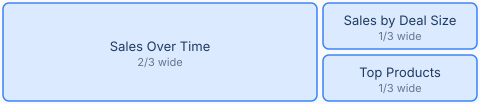
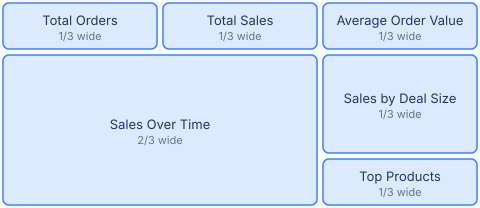
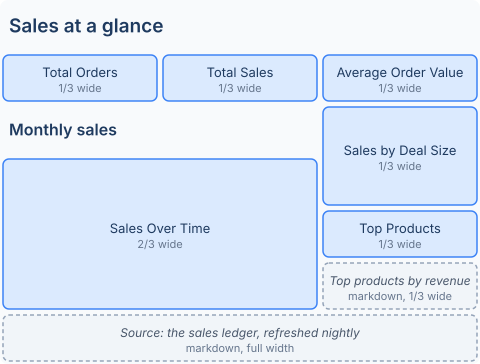

# Layout Sketches

Draw a dashboard's layout as text, right in the spec: each letter is a chart
(or a section header, or a note), and the drawing's proportions become the
dashboard's proportions. Every example on this page compiles as shown.

A sketch is three fields, in the spec's `layout` or inside any tab:

```json
"layout": {
  "sketch": ["KKKK LLLLLLLL"],
  "legend": {"K": "Total Sales", "L": "Sales Over Time"}
}
```

- `sketch`: one string per drawn line. Spaces are cosmetic; use them to keep
  the drawing readable.
- `legend`: maps each symbol to a chart's name from the spec, or to a header
  or markdown block ([Section headers and notes](#section-headers-and-notes)).
- `line` (optional, default 2): the height each drawn line adds. One drawn
  line is about 80 pixels of chart; raise or lower `line` to change that.

## Charts side by side

```text
KKKK LLLLLLLL
```


Letters share the row in proportion to how many you draw: `K` takes a third
of the page, `L` takes two thirds. To widen a chart, give it more letters.
Widths land on Superset's 12-column grid.

## Changing the ratio

The same two charts, redrawn with different letter counts:

```text
KKKKKK LLLLLL
```


```text
KKK LLLLLLLLL
```


A chart's share of the row is its share of the letters: six beside six is an
even split, three beside nine is a quarter beside three quarters. Resize a
chart by taking letters from its neighbor.

## Taller charts

```text
KKKK LLLLLLLL
.... LLLLLLLL
```


Repeat a line to make its charts taller: `L` spans two lines, so it is twice
as tall as `K`. The dots mark the space below `K` as deliberately empty.

## Charts stacked beside a tall one

```text
TTTTTTTT SSSS
TTTTTTTT PPPP
```



Stack different symbols in the same slot and they become a column: `S` sits
above `P`, both beside the tall `T`.

## Empty space

```text
AAAA BBBB ....
```


Dots leave cells empty. Superset packs charts to the left and top, so empty
space goes at the right edge of a row or the bottom of a stack; a dot
anywhere else stops the compile with a message naming the exact cell.

## A complete dashboard

```text
KKKK MMMM NNNN
LLLLLLLL SSSS
LLLLLLLL SSSS
LLLLLLLL PPPP
```



```json
"layout": {
  "sketch": [
    "KKKK MMMM NNNN",
    "LLLLLLLL SSSS",
    "LLLLLLLL SSSS",
    "LLLLLLLL PPPP"
  ],
  "legend": {
    "K": "Total Orders", "M": "Total Sales", "N": "Average Order Value",
    "L": "Sales Over Time", "S": "Sales by Deal Size", "P": "Top Products"
  }
}
```

A KPI row across the top, a tall chart spanning three lines, and a column of
two charts beside it. In a tabbed dashboard, each tab takes its own sketch.

## Section headers and notes

A legend symbol can also stand for text: a header, or a markdown block. The
same dashboard, titled, with a header over the trend and two notes:

```text
TTTTTTTTTTTT
KKKK MMMM NNNN
HHHHHHHH SSSS
LLLLLLLL SSSS
LLLLLLLL PPPP
LLLLLLLL CCCC
FFFFFFFFFFFF
```



```json
"layout": {
  "sketch": [
    "TTTTTTTTTTTT",
    "KKKK MMMM NNNN",
    "HHHHHHHH SSSS",
    "LLLLLLLL SSSS",
    "LLLLLLLL PPPP",
    "LLLLLLLL CCCC",
    "FFFFFFFFFFFF"
  ],
  "legend": {
    "T": {"header": "Sales at a glance", "size": "large"},
    "K": "Total Orders", "M": "Total Sales", "N": "Average Order Value",
    "H": {"header": "Monthly sales"},
    "L": "Sales Over Time", "S": "Sales by Deal Size", "P": "Top Products",
    "C": {"markdown": "Top products by revenue"},
    "F": {"markdown": "Source: the sales ledger, refreshed nightly", "height": 1.6}
  }
}
```

A header takes the fields of a header row (`header`, `size`, `background`)
and is one line tall: Superset sizes a header to its text, whatever the
drawing. Drawn across the whole sketch, like `T`, it is a section title
between bands, exactly as a header row in `rows`. Anywhere else it sits in a
column, because Superset puts headers between rows or in columns, never
beside charts in a row: `H` heads the column it shares with the trend. A
header alone in a slot narrower than the page gets a column of its own.

A markdown block is drawn like a chart: the drawing sets its width and its
height. An explicit `height`, in fifths of a unit as in rows, wins over the
drawn one, as a chart's does: `F` is 1.6 units, a 64 px strip, though it is
drawn one line tall. A `width` is refused, since the drawing already says how
wide the block is. Blocks follow the chart rules: each is a solid rectangle,
and dots go only at a row's right edge or a stack's bottom.

`chartwright decompile` reads charts stacked in columns back as a sketch, and
the section's headers and text blocks come with it. A section with a divider
stays in rows and flattens its columns, saying so; a header in the divider's
place keeps them.

## When a sketch is unclear

An ambiguous sketch is never guessed at: the compile stops with a message
naming exactly what to fix. The messages below are real output.

A symbol with no legend entry:

```text
KKKK XXXX
```

```
layout: sketch symbols not in legend: ['X']
```

Empty space between charts (it belongs at the row's right edge):

```text
AAAA .... BBBB
```

```
layout: empty column 5 between charts (line 1): Superset rows pack left;
empty space goes rightmost
```

A chart whose letters do not form one rectangle:

```text
LLLL LLLL
LLLL ....
```

```
layout: symbol 'L' does not form a solid rectangle
```

A header drawn taller than one line:

```text
HHHHHHHHHHHH
HHHHHHHHHHHH
LLLLLLLLLLLL
```

```
layout: header 'H' spans 2 lines: a header is one sketch line (Superset sizes
it to its text)
```

## The rules in one place

| Rule | Meaning |
|---|---|
| One string per line | Spaces are cosmetic; every line must have the same number of cells once spaces are removed |
| Every symbol maps to a chart or a block | Each symbol needs a legend entry (a chart's name, a header or a markdown block), and each legend entry must appear in the drawing |
| More letters make a chart wider | Letters share the row in proportion, on Superset's 12-column grid |
| More lines make a chart taller | Each drawn line adds `line` height units (default 2, about 80 pixels) |
| A chart is a solid rectangle | A symbol's cells must form one unbroken rectangle |
| A stack becomes a column | Different symbols stacked in the same slot compile to a Superset column |
| Dots mean deliberately empty | Legal at a row's right edge or a stack's bottom, where Superset can express absence |
| A header is one line | Across the whole sketch it is a section title between bands; elsewhere it sits in a column |
| A markdown block is drawn like a chart | The drawing sets its width; its own `height` (fifths of a unit) wins over the drawn one |

Prefer explicit numbers? `layout.rows` with per-chart widths and heights does
the same job without drawing, and dragging a chart taller in the UI followed
by `chartwright absorb` writes the polished height back into the spec.

## A header above every tab

`layout.header` is the footer's mirror: rows, exactly like `layout.rows`,
placed above the rows, tabs, or sketch, outside any tab. On a tabbed dashboard
Superset draws them above whichever tab is open, so one banner serves every
tab:

```json
"layout": {
  "header": [[{"markdown": "**Draft**: figures reconcile with the finance close", "width": 12, "height": 1.6}]],
  "tabs": [{"title": "Overview", "rows": [["Revenue"]]}, {"title": "Detail", "rows": [["Orders"]]}]
}
```

Adding, editing or removing a header leaves the rest of the dashboard as it
was: the body's rows, markdown and charts keep their positions in Superset's
layout, so a header can be added to a dashboard people already use. A header
works with flat rows, tabs and a sketch, and beside a footer. Decompile reads
any rows above a dashboard's tabs as its header, including rows dragged there in
Superset's UI; without tabs, only rows chartwright compiled as a header read
back as one. The design critic reviews header rows like the body's, and counts
the header's height against every tab's fold budget, since every tab opens
below it.

## A footer under every tab

`layout.footer` takes rows, exactly like `layout.rows`, and places them below
the rows, tabs, or sketch, outside any tab. On a tabbed dashboard Superset
draws them under whichever tab is open, so one footer serves every tab:

```json
"layout": {
  "tabs": [{"title": "Overview", "rows": [["Revenue"]]}, {"title": "Detail", "rows": [["Orders"]]}],
  "footer": [[{"markdown": "Maintained by the analytics team", "width": 12, "height": 1.6}]]
}
```

Markdown heights take fifths of a unit, one Superset grid row (8 px) each, so a
slim strip fits exactly: `1.6` is 64 px. Superset pads a text block 16 px on
every side, so the block needs its content's height plus 32 px, or it scrolls,
and it draws no block under 1 unit (40 px). `chartwright advise` estimates the
height each block's text takes at its width, in the sizes the dashboard's CSS
sets, and names a block too short for it (`size.markdown-fit`); `advise --fix`
raises the block.

A footer row may hold charts as well as markdown; each chart is still placed
exactly once. Decompile reads any rows below a dashboard's tabs as its footer,
including rows dragged there in Superset's UI. Without tabs there is no
visible boundary, so only rows chartwright compiled as a footer read back as
one. The design critic reviews footer rows with the same sizing and layout
rules as the body; only tab balance and the section-header check leave the
footer (and the header) out.
