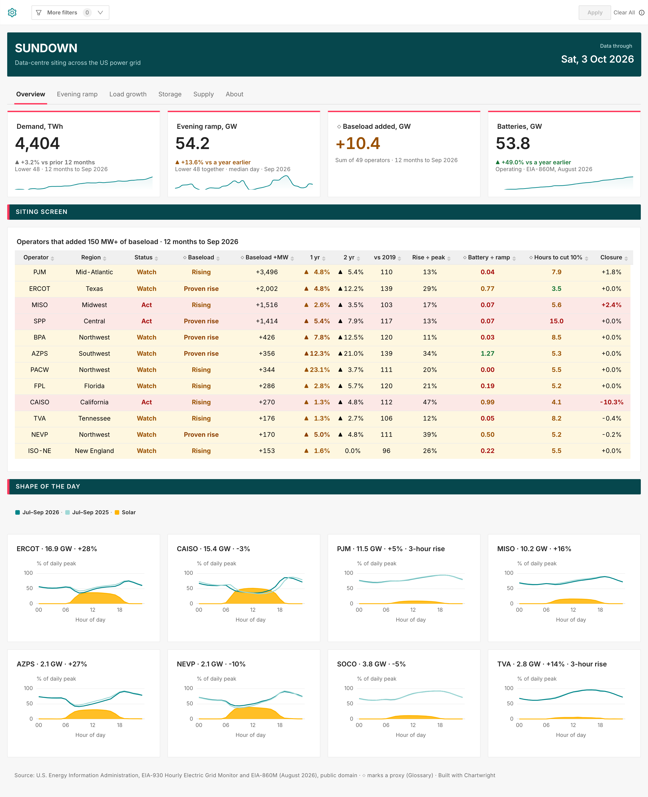
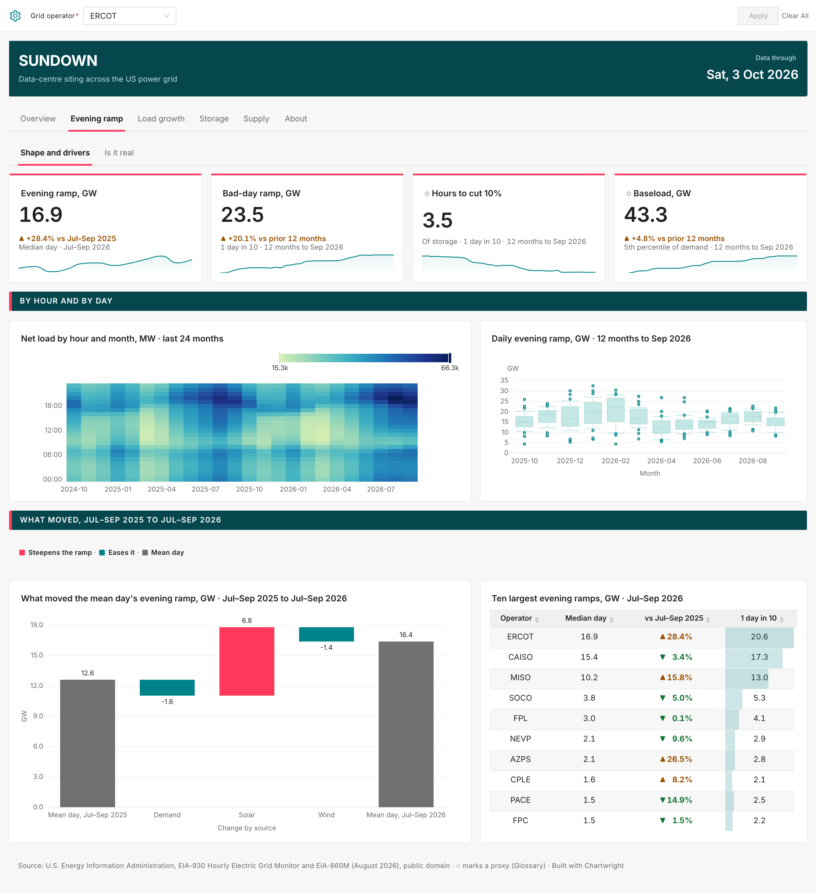
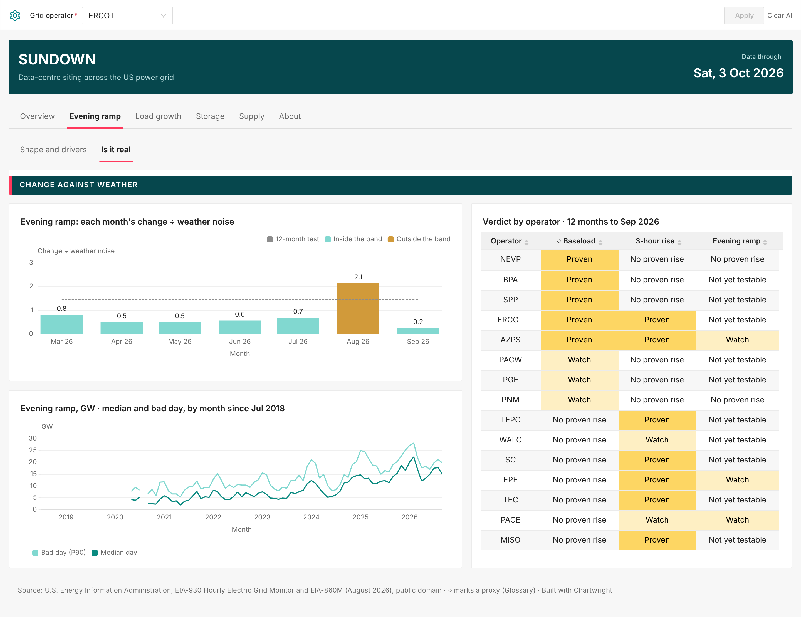
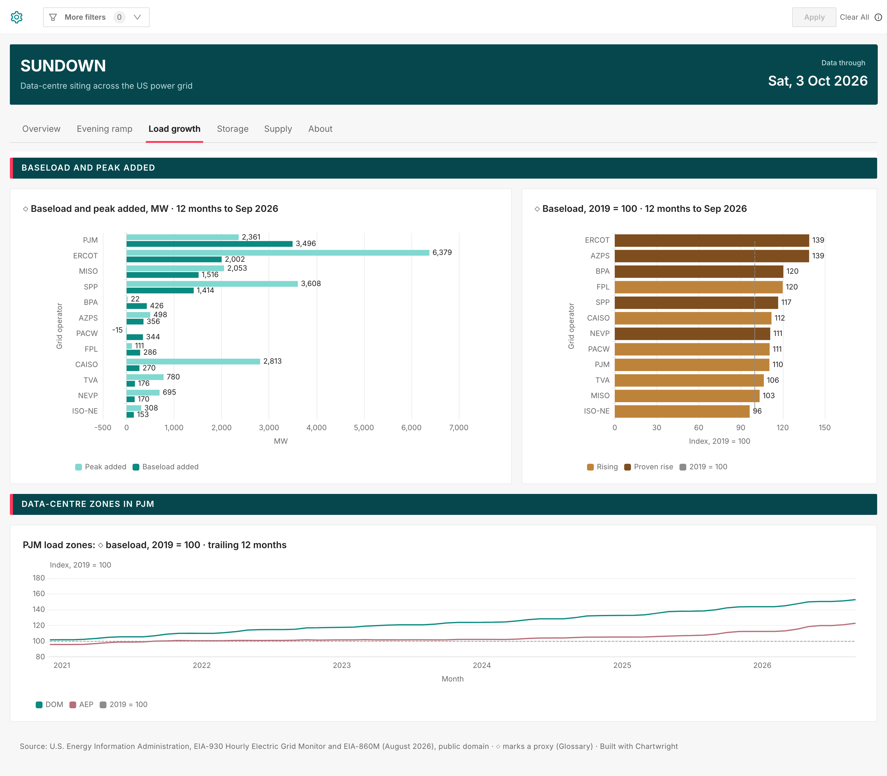
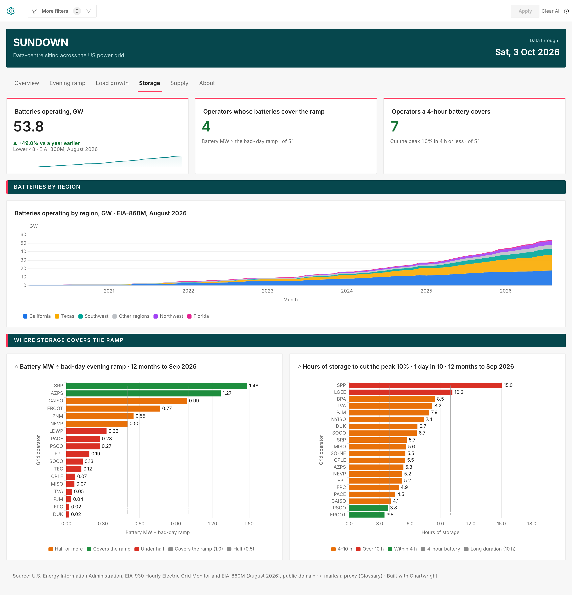
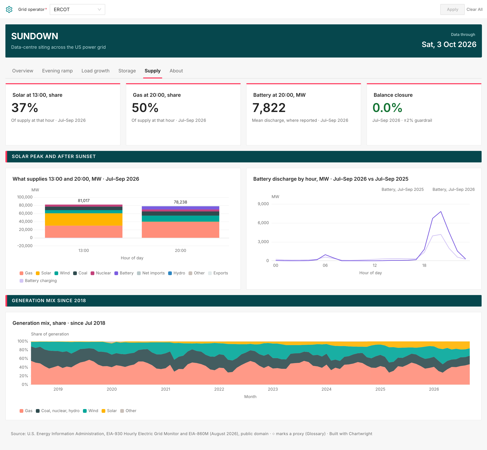
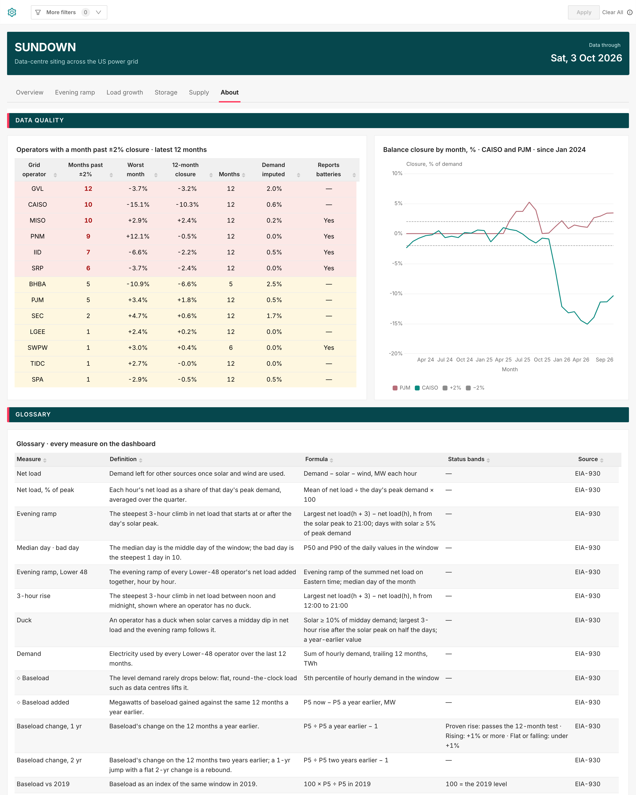

# Sundown

A six-tab dashboard for siting data centres on the US power grid, built from one spec with Chartwright. The data is EIA-930 hourly grid data and EIA-860M. It's the dashboard in Chartwright's README.

## What's here
- `sundown.json`: the spec. `chartwright validate`, `compile` and `advise` run on it as it is.
- `build_spec_sundown.py`: writes the spec from `facts.json` and a palette. `facts.json` holds the numbers the titles and time windows are built from.
- `palettes/`: seven palettes, `coral-teal-v2` by default. A palette sets every colour in the spec (its CSS, label colours and colour rules) and in the theme.
- `theme/`: the Superset theme the spec names (`"theme": "Sundown"`), and a script that creates or updates it through Superset's API.

## Rebuild it in another palette
```sh
python3 build_spec_sundown.py facts.json robins-egg > sundown.json
SUPERSET_URL=https://superset.example.com SUPERSET_PASSWORD=... python3 theme/create_theme.py robins-egg
chartwright apply sundown.json --profile <profile>
```

## What it needs to run
- **`apply` needs the warehouse.** The spec reads a Postgres warehouse with a `sundown` schema built from EIA-930 and EIA-860M, which are public domain. The data pipeline isn't included, so `apply` works only against such a warehouse.
- **The theme needs Superset 6.0 or later.** On 4.1 or 5.0, remove `"theme"` from the dashboard block; the dashboard keeps the colours its CSS sets.

## Every tab
These are the live dashboard in the `coral-teal-v2` palette. Under each, the parts of the spec that draw it. Across all tabs:
- clicking a value in one chart filters the others (`"cross_filters": true`);
- one `Grid operator` select filter is scoped to the 16 charts that show a single operator;
- full-width section bands are `{"header": ...}` rows, styled by the dashboard CSS.

### Overview

- **KPI cards:**
  - **Changes:** `big_number_trend` charts with `compare_lag`. The dashboard CSS colours each change by what it means and adds ▲ or ▼: a steeper evening ramp is amber, more batteries is green.
  - **Baseload added:** a `big_number_total` whose `conditional_formatting` turns it amber above zero.
- **Siting screen:** a `table` with `conditional_formatting` that:
  - tints each row by its status (`"apply_to": "row"`);
  - colours the status words (`"paint": "text"`).

  `column_align` centres every column.
- **Shape of the day:** eight `mixed` charts. Each shows solar as a filled area under this quarter's net load and last year's.

### Evening ramp: Shape and drivers

- **Net load:** a `heatmap`. `x_label_every` and `y_label_every` thin its labels, and `left_margin` gives the hour labels room.
- **Daily ramps:** a `box_plot` per month, with whiskers at the 10th and 90th percentile days.
- **What moved:** a `waterfall` bridge from last year's mean day to this year's, with `steps` in a fixed order and its own colours.
- **Ten largest ramps:** a `table` with `cell_bars` on the bad-day column only. A colour rule paints each change's arrow amber or green.

### Evening ramp: Is it real

- **Layout:** a `sketch` layout. A header block sits across the top, the verdict table runs beside both charts, and the two charts stack on the left.
- **Signal chart:** a `mixed` chart whose dashed line is an annotation at the 12-month test's threshold.
- **Verdict table:** colour rules fill each verdict cell.

### Load growth

- **Bars:** horizontal `bar` charts with axis titles and value labels.
- **Index bars:** coloured by status through `label_colors`, with a reference line at 100.

### Storage

- **KPIs:** two `big_number_total` cards turn green through `conditional_formatting`.
- **Batteries by region:** a stacked area.
- **Coverage bars:** horizontal bars coloured by band, with dashed threshold lines.

### Supply

- **Share KPIs:** computed with `SQL(...)` metrics.
- **Balance closure:** green within ±2% and red outside, from three `conditional_formatting` rules.
- **Fuel bars:** stacked, labelled with their totals (`only_total`).
- **Generation mix:** a 100% stacked area (`"contribution": "row"`).

### About

- **Data-quality table:** tints rows red or amber by how many months broke the ±2% check.
- **Closure line:** draws both limits as reference lines.
- **Glossary:** a table defining every measure on the dashboard.
